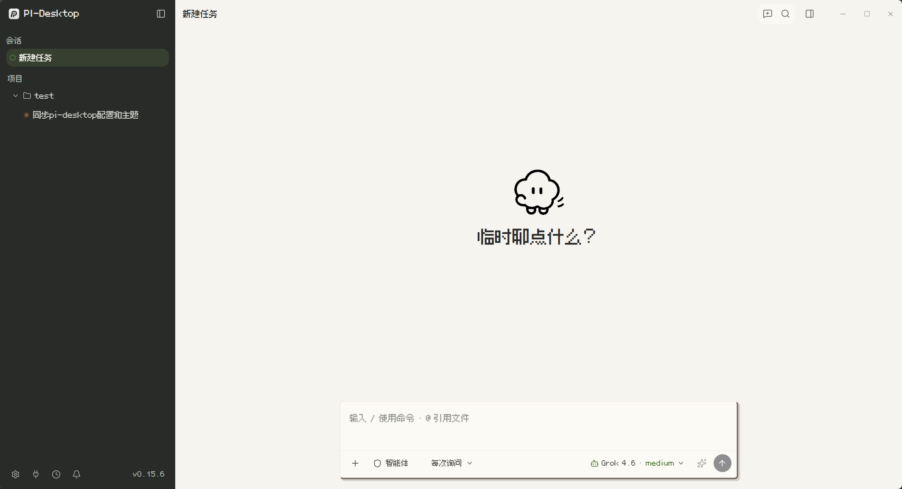
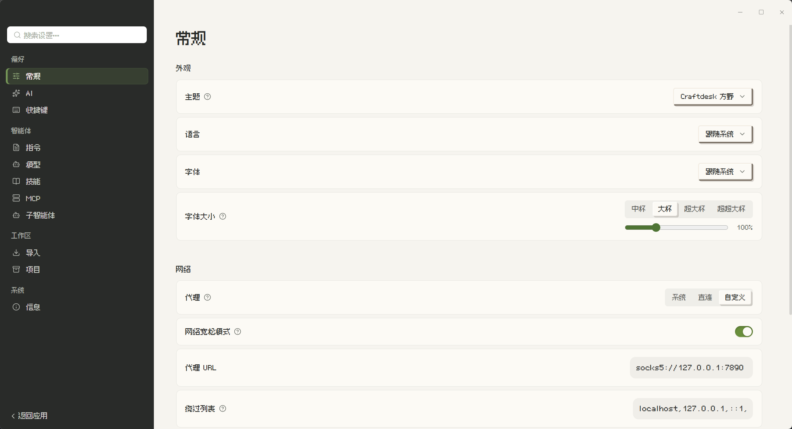

<p align="center">
  
</p>

<h1 align="center">Craftdesk 方野</h1>

<p align="center">
  <strong>A restrained pixel-workbench theme for <a href="https://github.com/vastsa/PI-Desktop">PI-Desktop</a></strong><br/>
  暖灰制图网格 · 炭黑导航 · 草绿只留给状态和焦点
</p>

<p align="center">
  
  
  
  
</p>

参考触感式游戏界面的材质语言，但不复制游戏 UI：24px 制图网格铺在暖纸上，侧栏沉进炭黑，强调色克制到开关、焦点和选中条。中文界面使用开源 BoutiqueBitmap 9x9 点阵体，代码使用 JetBrains Mono。

## Preview

<p align="center">
  
</p>

| Surface | Token | Hex |
|---|---|---|
| Paper | `--ds-bg-primary` | `#f6f4ef` |
| Sidebar | `--ds-bg-sidebar` | `#292b29` |
| Raised card | `--ds-raised` | `#fcfaf5` |
| Accent / success | `--ds-accent` | `#4f7434` |
| Warning / error | `--ds-warning` / `--ds-error` | `#aa742d` / `#b84c42` |

Tokens live on `:root[data-theme="light"]`. Chrome is scoped to host classes that actually exist (`.sidebar`, `.composer-shell`, `.settings-theme-search`, …).

## Install

### From this folder (development)

1. PI-Desktop → **插件** → overflow → **Load development plugin**
2. 选中本仓库根目录（含 `manifest.json`）
3. **设置 → 主题 → Craftdesk 方野**

选中后的设置值是：

```text
plugin:io.github.jeasonloop.theme-craftdesk:craftdesk
```

不要只写短 id `craftdesk`。改完主题后请**彻底退出应用（含托盘）再打开**。

### Marketplace

官方插件中心是 [plugins.aiuo.net](https://plugins.aiuo.net)。本仓库是可复现的源；上架步骤：

1. 打 `v1.4.9` tag（本仓库已按该版本发布）
2. 在插件中心提交本 GitHub 仓库，`sourceRef` 指向该 tag
3. 审核通过后会出现在 PI-Desktop **插件 → 市场** 使用的 `catalog.json`

也可按 [`vastsa/pi-desktop-plugins` CONTRIBUTING](https://github.com/vastsa/pi-desktop-plugins/blob/main/CONTRIBUTING.md) 提交 catalog PR。GitHub 本身不等于市场上架。

## Layout

```text
pi-theme-craftdesk/
├── manifest.json          # reverse-domain id, ui.theme + ui.panel
├── main.js                # required lifecycle no-ops
├── themes/craftdesk.css   # design-token overrides
├── fonts/*.woff2          # bundled OFL faces
├── renderer/index.html    # local info panel
└── static/                # README previews
```

对照 [eonova/pi-theme-dracula](https://github.com/eonova/pi-theme-dracula)：同样是声明式 `contributes.themes`，入口为空钩子。方野额外捆绑字体和一个说明面板。

## Permissions

| Permission | Why |
|---|---|
| `ui.theme` | 注册主题 CSS |
| `ui.panel` | 本地说明面板 |

无 `net.fetch` / `fs.*` / `clipboard.*` / `agent.*`。宿主会净化 CSS：禁止 `@import`，`url()` 只能是 `data:` 或声明在 `contributes.themes[].assets` 里的**绝对**路径。

PI-Desktop **0.15.6** 的 host-core 在市场安装时拒绝相对 theme assets（`fonts/*.woff2` → `PLUGIN_INVALID`）。本主题把字体嵌进 CSS 的 `data:font/woff2;base64,...`，**不再声明 `assets`**。BoutiqueBitmap 受 256 KiB CSS 上限限制，内嵌的是 Latin + 设置/侧栏常用汉字子集（覆盖「常规 / 偏好 / 智能体 / 工作区」等宿主文案），长文中文仍回退系统黑体。完整 OFL 字文件仍在 `fonts/`。若 Settings 列表没有「Craftdesk 方野」，检查 `~/.pi-desktop/logs/app/plugin.log` 是否出现 `plugin.themes.skipped` / `INVALID_CSS`。

## Fonts

- [BoutiqueBitmap 9x9](https://github.com/scott0107000/BoutiqueBitmap9x9) — 见 `fonts/OFL-BoutiqueBitmap.txt`
- [JetBrains Mono](https://github.com/JetBrains/JetBrainsMono) — SIL OFL 1.1，见 `fonts/OFL-JetBrainsMono.txt`

点阵体只有一个字重，主题全局 `font-synthesis: none`，避免伪粗体把字形抹糊、和图标对不齐。

## Develop

改 `themes/craftdesk.css` 后保存即可（开发插件会热重载）。新增权限需要重新 Load，不能只靠热重载。

打包（需 PI-Desktop 仓库里的 devkit）：

```bash
pnpm pi-plugin check .
pnpm pi-plugin pack .
# dist/io.github.jeasonloop.theme-craftdesk-1.4.9.piplug
```

`.piplug` 必须是 store-only ZIP；普通压缩 zip 会被安装器拒绝。

提交插件中心前：

```bash
pnpm pi-plugin publish . --ref v1.4.9 --channel stable
```

会生成 `dist/<id>-<version>.submission.json`，把 `.piplug` 挂到同一 commit 的 GitHub Release，再把 payload 交到插件中心。中心会从 forge 重新解析源，不信任本地记录。

## Privacy

纯样式。不访问网络、工作区文件、剪贴板或 Agent。中英 metadata 跟随应用语言。

## License

主题代码 MIT。捆绑字体仍为各自的 OFL / 原始许可，见 `LICENSE` 与 `fonts/`。
